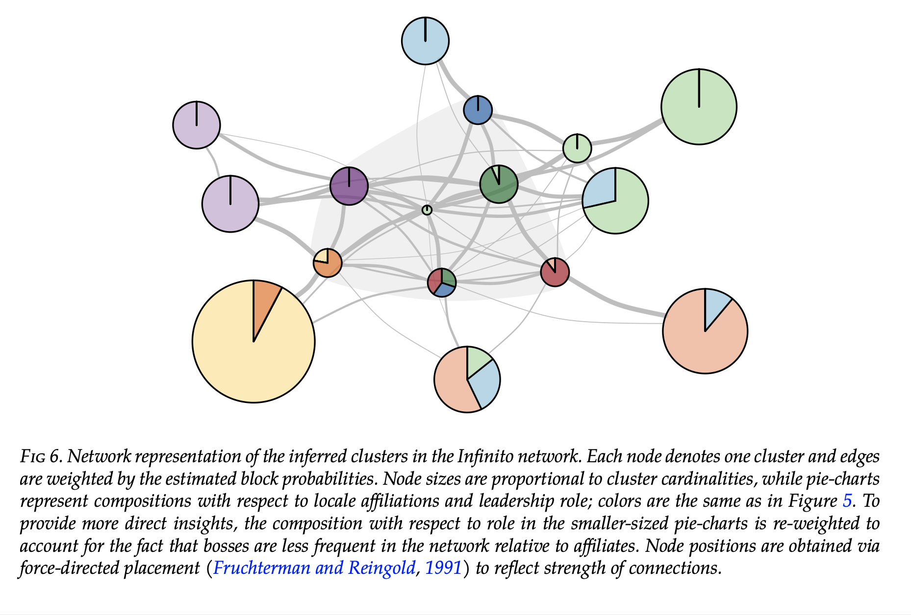
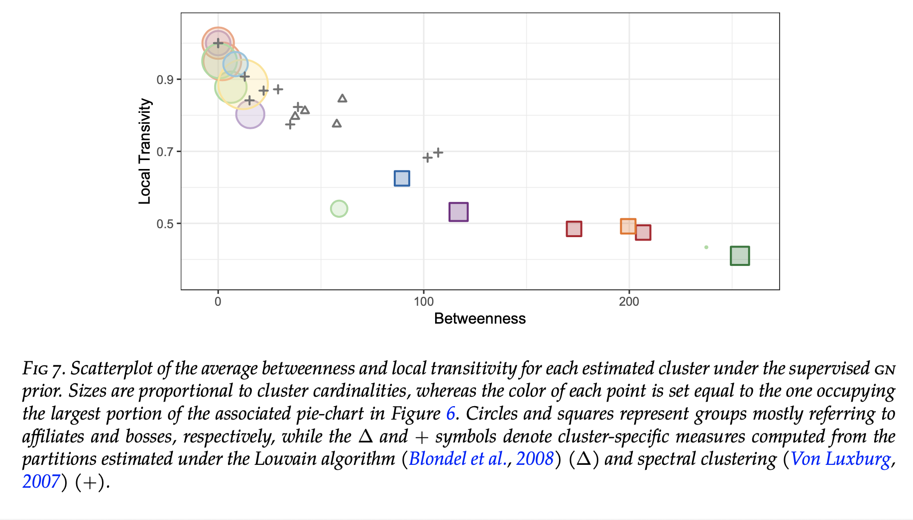

# EXTENDED STOCHASTIC BLOCK MODELS WITH APPLICATION TO CRIMINAL NETWORKS

To cover these gaps, we develop a new class of extended stochastic block models (esbm) that infer groups of nodes having common connectivity patterns via Gibbs-type priors on the partition process. 

## Useful Items

