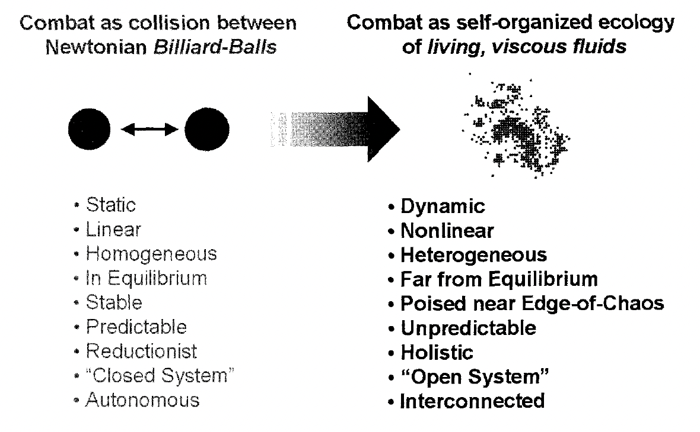
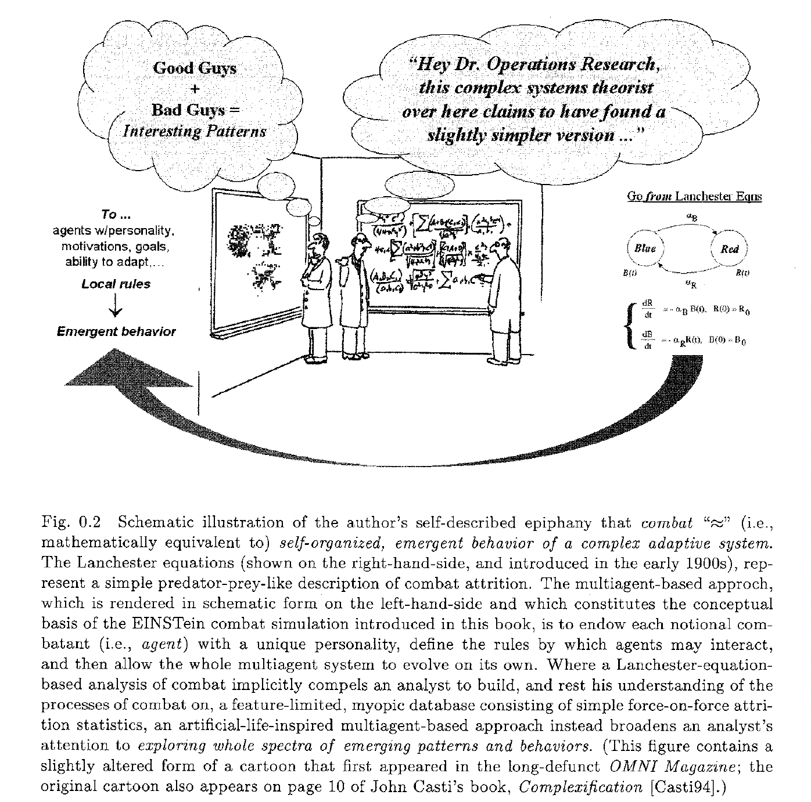
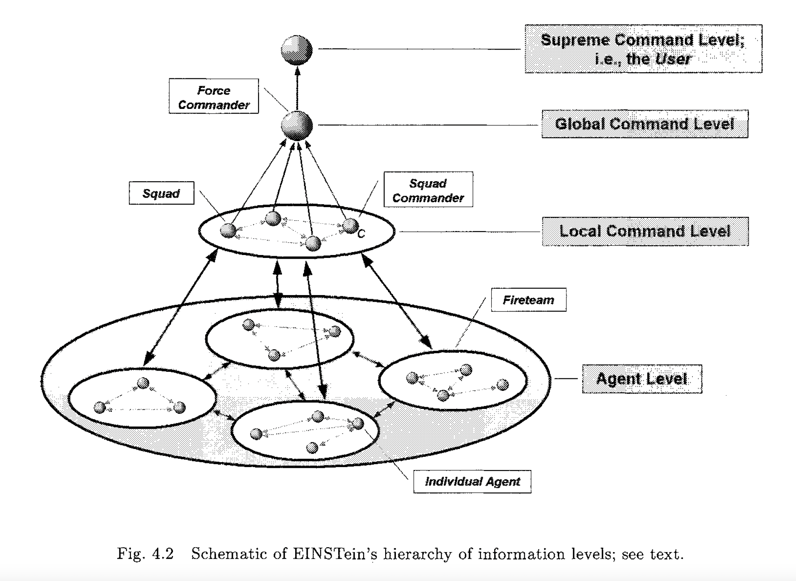
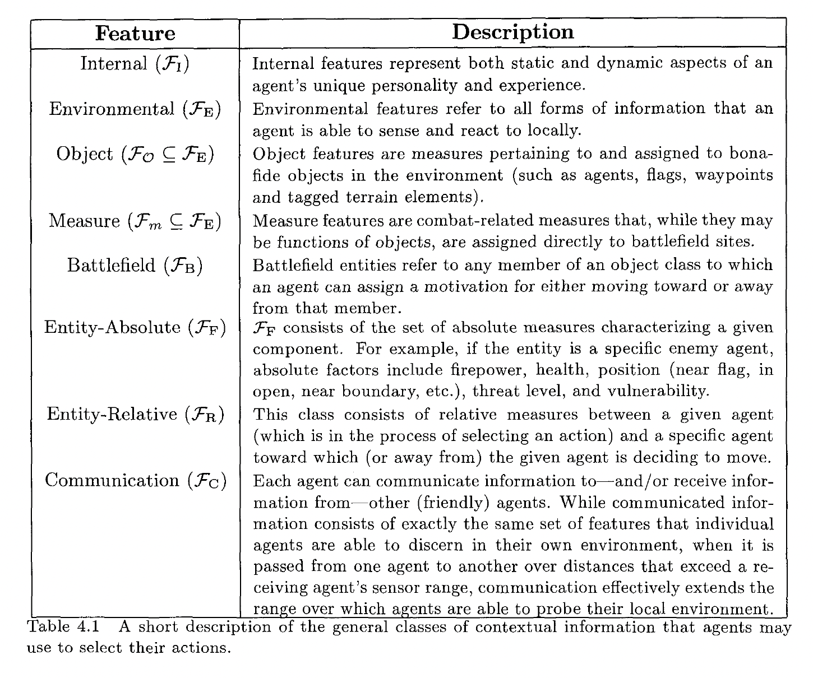

# ARTIFICIAL WAR Multiagent-Based Simulation of Combat

Military conflicts, particularly land combat, possess the characteristics of complex adaptive systems: combat forces are composed of a large number of nonlinearly interacting parts and are organized in a dynamic command-and-control network; local action, which often appears disordered, self-organizes into long-range order; military conflicts, by their nature, proceed far from equilibrium; military forces adapt to a changing combat environment; and there is no master “voice” that dictates the actions of every soldier (i.e., battlefield action is decentralized). Nonetheless, most modern “state of the art” military simulations ignore the self-organizing properties of combat.This book summarizes the results of a multiyear research effort aimed at exploring the applicability of complex adaptive systems theory to the study of warfare, and introduces a sophisticated multiagent-based simulation of combat called EINSTein. EINSTein, whose bottom-up, generative approach to modeling combat stands in stark contrast to the top-down or reductionist philosophy that still underlies most conventional military models, is designed to illustrate how many aspects of land combat may be understood as self-organized, emergent phenomena. Used worldwide by the military operations research community, EINSTein has pioneered the simulation of combat on a small to medium scale by using autonomous agents to model individual behaviors and personalities rather than hardware.

( [link to download](https://drive.google.com/file/d/1wJgiEgDYj_BRjCsieNLY7le1dSDRuWoS/view?usp=sharing) )

## Useful Items

### Authors approach

### The EINSTein Model

- Combat Agent Level
  - The lowest level is the one on which the dynamical interactions between agents occur.
- Local Command Level
  - The next two levels are command levels that consist of information pertinent to making decisions regarding the behavior on lower levels
- Global Command Level
  - Global commanders use global information to issue movement vectors to local commanders
- Supreme Command Level
  - the top-level supreme commander represents the interactive user of the software
  - The user is responsible for completely defining a given scenario, fixing the size and features of the notional battlefield, setting the initial force dispositions, and specifying any auxiliary combat conditions (such as fratricide, reconstitution, combat termination conditions, and so on). The supreme commander also defines the mission objective required by the genetic algorithm.

#### Design Philosophy

- Simplicity
  - keep rules small, and by defining those rules as simply as possible
  - The idea is to qualitatively probe the behavioral consequences of the interaction among a large number of notional variables, not to provide an explicit detailed model of the minutiae of real-world combat.
- Consistency
  - EINSTein is designed so that almost all **dynamical decisions are adjudicated as locally optimal penalty assessments**
    - 💡 How does communication, structure, or policies lead to globally optimium solutions, or at least increase the scope of optimality? 
  - Because decisions on different levels necessarily involve different kinds of information one must be careful to **use the information that is important for a decision on a given level in a manner that is appropriate for that particular level**
- The decisions taking place on different levels are all mutually consistent in that each decision-maker follows the same general template of probing and responding to his environment.
  - What are my immediate and long-term goals?
  - What do I currently know about my local environment?
  - What must I do to attain my goals?

**"Intelligent" Agent**
- **Reactive**: agents “react” to environmental stimuli that consist both of actions by other agents and of fixed features of the env.
- **Goal-directed**: agents base their actions on simple goals that they are motivated to fulfill.
- **Boundedly rational**: all actions are derived from a well-defined, logical inference engine applied to localized information,
- **Interactive**: agents interact with eachother

**Mathematical form**

Agent acts to minimize penatly function:

$Z(x) = \sum_{A} w(A) \cdot \mu (A;x)$

where $A \in$ the set of all actions, $\mu$ is a measure of success of taking action $A$ given agent state $x$.

