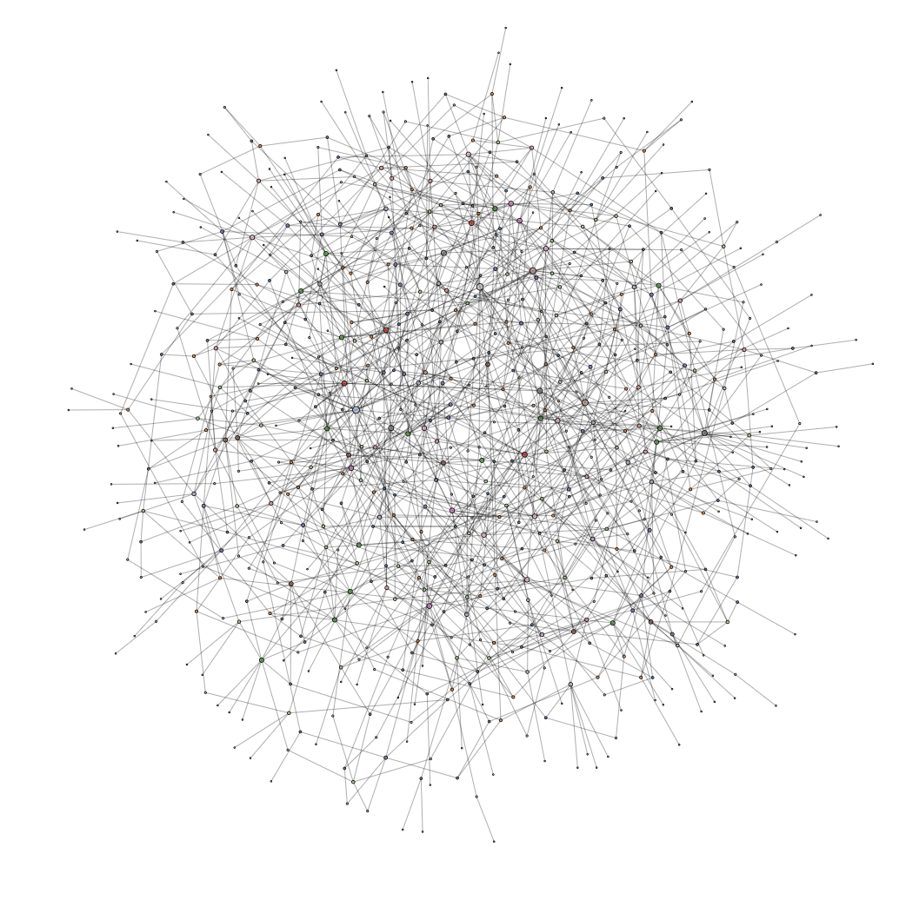

# Crime-Moreno

>Visualize ia-crime-moreno's link structure and discover valuable insights using the interactive network data visualization and analytics platform. Compare with hundreds of other network data sets across many different categories and domains.

( [link to view](https://networkrepository.com/ia-crime-moreno.php) )
## Useful Items

Also let's you download the network data.

    @inproceedings{nr,
        title={The Network Data Repository with Interactive 
        Graph Analytics and Visualization},
        author={Ryan A. Rossi and Nesreen K. Ahmed},
        booktitle={AAAI},
        url={https://networkrepository.com},
        year={2015}
    }
