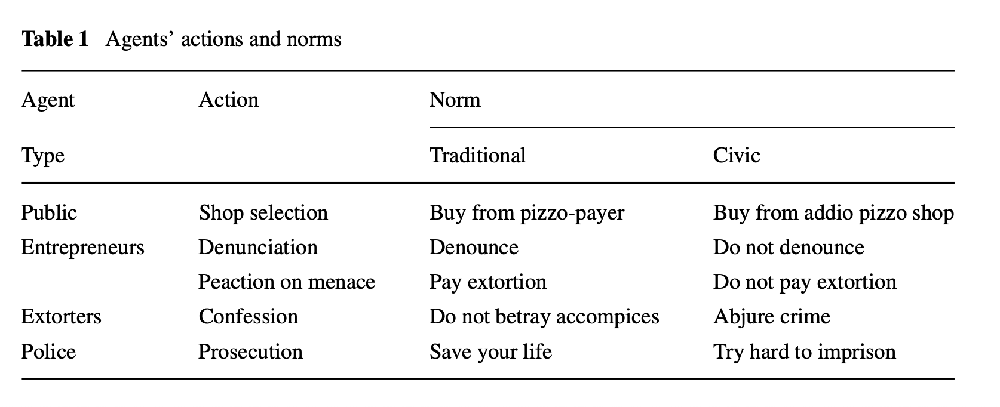

# Can agent-based simulation models replicate organised crime?

The aim of the paper is to discuss the possibility of using complex soft- ware agents in a simulation model in order to represent and analyse the dynamics of certain types of criminal systems via Agent Based Modelling (ABM), in particular Extortion Racket Systems (ERSs).

[Netlogo Model](http://ccl.northwestern.edu/netlogo/models/community/NOERS)

## Useful Items

The version of the mafia models which this paper uses for its argumentation represents a fictitious region whose economy simply consists of
* a number of firms (of any kind),
* a number of people consuming the goods and services (of any kind) of these
firms (and supplying these firms with goods, services and staff),
* persons who engage themselves in extortion rackets, asking the firms for extortion money and eventually punishing them when they refuse to pay,
* police officers who observe criminals whose earlier deeds were recorded and/or
who were reported by their victims or by rueful accomplices and
* a court which can sentence criminals to jail terms of a number of years.
each run of the model represents such a virtual region and describes what could have happened in a real region described with the parameters and initialisations of this run.

For designing the microspecification of the simulation model the following sources were used:
* Stylised facts and anecdotal evidence from the literature:
* Interviews with stakeholders: 
* Sicurezza dei cittadini (ISTAT 2008): This survey carried out by the Italian National Institute for Statistics in 2008 (Istituto nazionale di statistica ) (for the third time after 1997 and 2002, the 2015/2016 wave is not yet available) asked 60,000 households for their experience with crime, among them menace and extortion
* European Value Study (2008): This study (EVS 2008) deals with value orientations all over Europe. Among the questions relevant to mafia-related crime there is a group of items dealing with norms or values which people find important enough to teach their children.
* Eurobarometer 79.1 (2013): This Eurobarometer (Commission and Opinion 2011) is the only survey so far which deals with crime similar to mafia-related cases, but deals mainly with corruption.
* Sicilia and Calabria Extortion database:

why this might be useful, and link to a [concept](../concepts/template.md)

