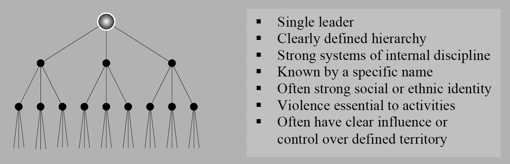
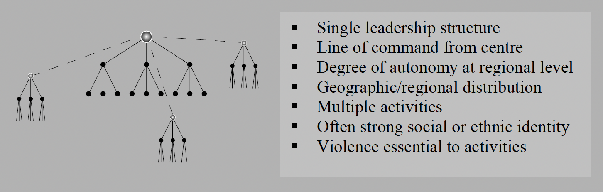
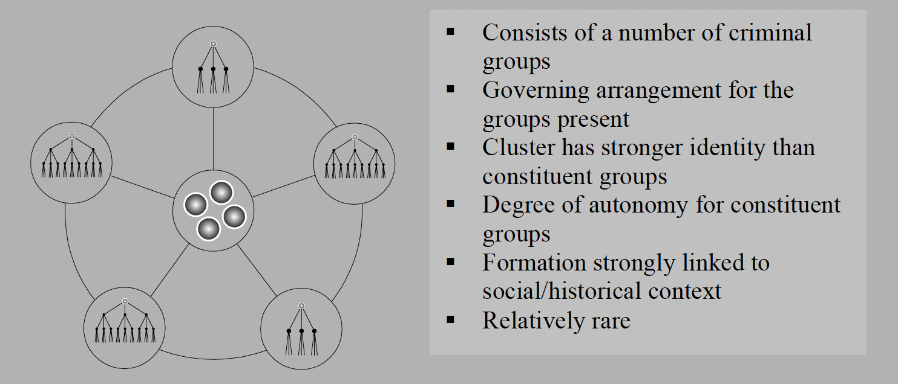
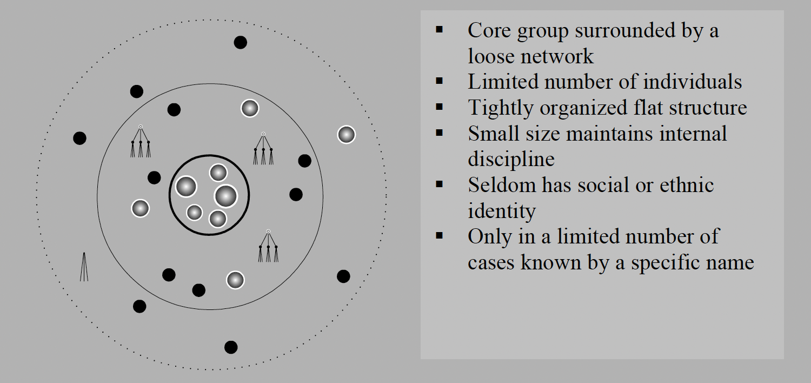
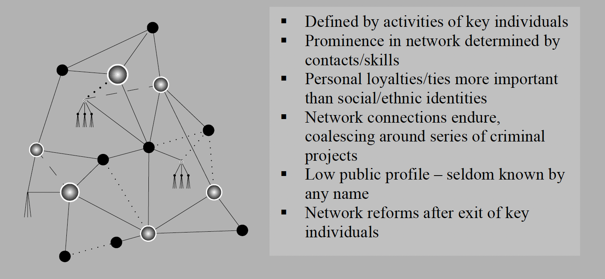

# Results of a Pilot Survey of Fourty Selected Organized Criminal Groups in Sixteen Countries - UNODC 2002

Survey of fourty organized crime groups in 16 countries asking questions on:
1. Organizational structure
2. Violence
3. Economic resources
4. Political resources
5. Response of Law Enforcement Agencies to Organized Crime
6. The external environment

( [link to download](https://www.unodc.org/pdf/crime/publications/Pilot_survey.pdf) )

## Useful Items

### Network Structure/Typology
Standard hierarchy (p39)

**Regional hierarchy**

**Clustered hierarchy**

**Core group**

Criminal network

**Group Profile**
  - Structure
  - Size
  - Violence
  - Ethnic and social identity

