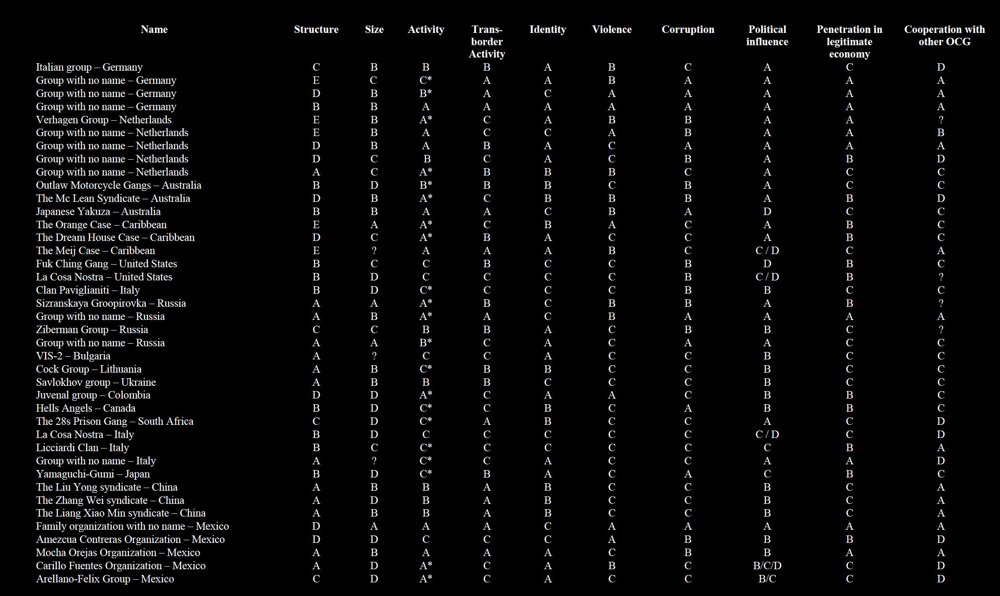

# Results of a Pilot Survey of Fourty Selected Organized Criminal Groups in Sixteen Countries - UNODC 2002

put a summary of the abstract here, or just paste a few key sentances

( [link to download](https://www.unodc.org/pdf/crime/publications/Pilot_survey.pdf) )

## Useful Items

